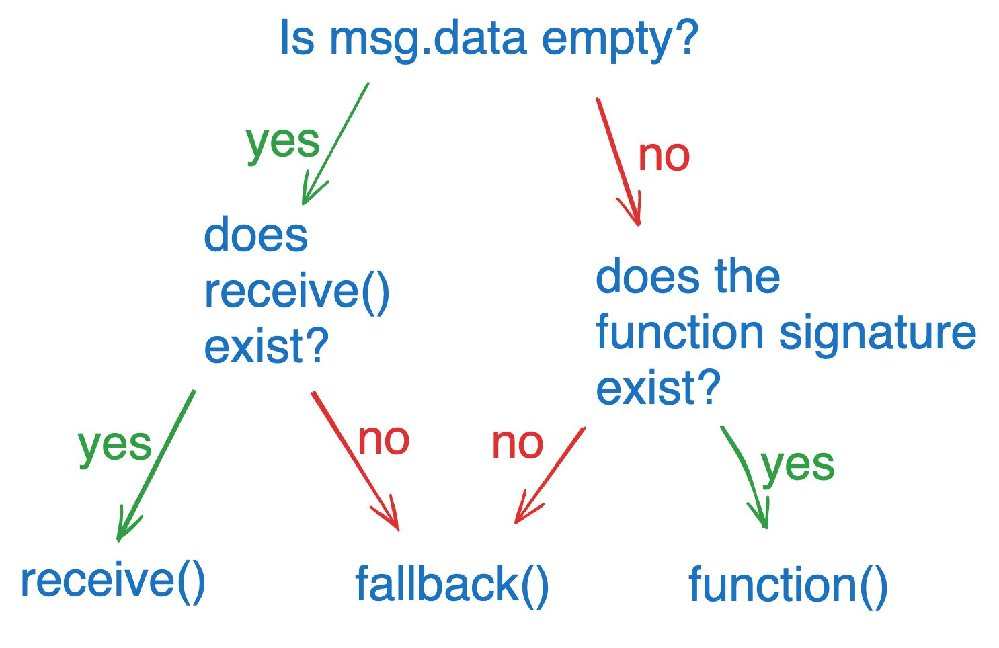

## How Smart Contracts Accept Ether

- (fallback(), receive(), & Payable Functions)
- Understanding payable, receive(), and fallback() is essential for wallets, DeFi apps, and payment contracts.
- payable (Allowing Ether Transfers):

- By default, functions cannot receive Ether.
- Adding payable tells Solidity:
- “This function is allowed to accept ETH.”
- Without this, the function will reject any Ether sent to it.

#

receive() function:

- A special function that triggers when someone sends ETH directly to the "contract address" without calling any specific function.
- It takes no arguments and returns nothing.

receive() is triggered when:-

- ETH is sent
- msg.data is empty
- must be external, payable

fallback() function:

- The "Safety Net."
- This triggers if someone calls a function that doesn't exist in the contract,
- or if they send ETH and receive() isn't defined.

fallback() is triggered when:-

- Function does not exist
- msg.data is not empty
- must be external, payable

#

